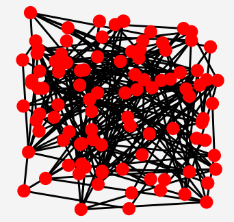
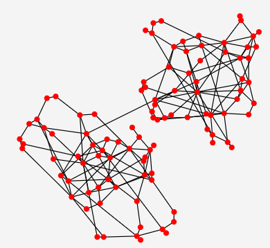

# GraphVizualization
Приложение для визуализации графов.
Предоставляет инструментарий для:
1) Раскладки графа на плоскости (ForceAtlas2)
2) Выделение ключевых вершин (Harmonic Centrality algorithm)

### ForceAtlas2
Быстрый (для количества вершин <= 10000) алгоритм укладки ненаправленных графов на плоскости.
***
До укладки: 

***
После укладки: 

***

##### Режимы работы алгоритма
* BurnsHut mode - режим, в котором алгоритм будет выполняться с оптимизацией BurnsHut (улучшает асимптотику с n2 до n * log(n) от количества вершин)
* Prevent overlapping mode - режим, в котором будет предотвращаться перекрытие вершинами друг друга
* Dissuade hubs mode - режим, в котором вершины с большей степенью будут слабее притягиваться, чем вершины с низкой степенью (делает сообщества более разреженными)

##### Переменные, влияющие на работу алгоритма
* burnsHutTheta - параметр, влияющий на точность и скорость укладки графа в режиме BurnsHut mode (чем выше значение параметра, тем более быстро и менее точно произведется укладка)
* repulsion - параметр, влияющий на визуальное отображение раскладки (чем он выше, тем дальше друг от друга будут располагаться вершины)
* gravity - параметр, влияющий на то, насколько вершины могут отлететь далеко от изначального центра своего местоположения
* tolerance - параметр, влияющий на то, насколько вершины могут колебаться по итогу итерации (чем выше, тем ниже точность укладки и выше скорость)
* edgeWeightDegree - параметр, от которого зависит степень влияния веса ребер на укладку (чем выше, тем больше влияние)

### Harmonic Centrality algorithm
Алгоритм выделения ключевых вершин графа на основе их гармонической центральности. 

#### Переменные, влияющие на работу алгоритма 
* centralityScale - параметр, влияющий на радиус вершин в зависимости от центральности

### Louvain algorithm
Алгоритм выделения сообществ в графе